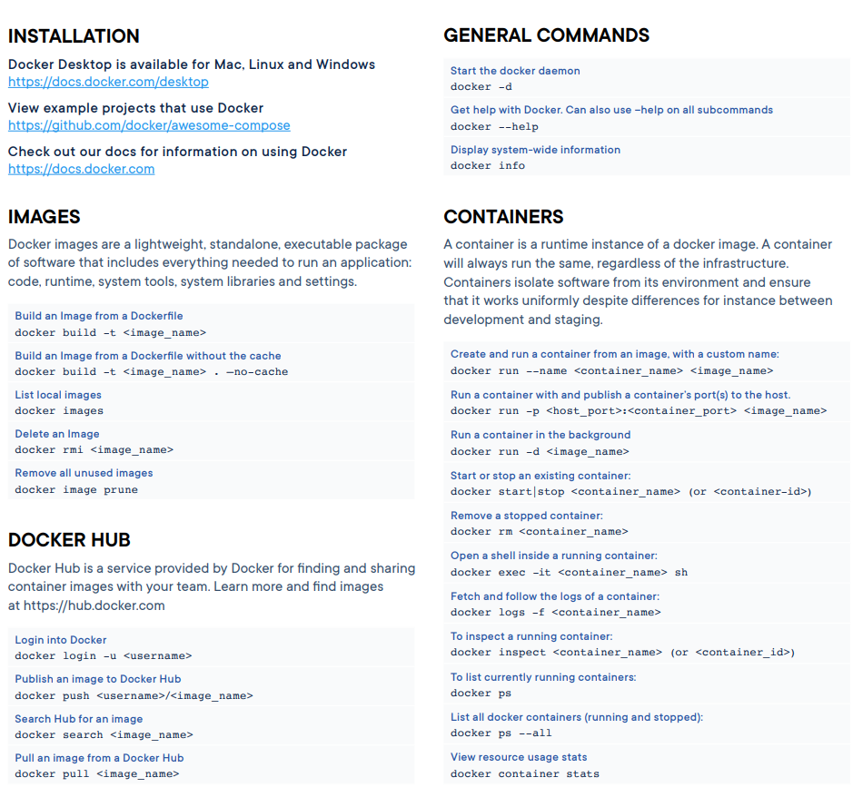

# Docker
- Khái niệm: Là nền tảng phần mềm cho phép xây dựng, kiểm thử, triển khai các ứng dụng trên những môi trường và hệ điều hành khác nhau
- Docker tạo ra những môi trường cách ly được gọi và container, các ứng dụng được chạy qua các container này. Nó sẽ đóng gói tất cả những thứ cần thiết để chạy ứng dụng (gọi là container)
- Vì sao cần Docker?
    -  Sự tương thích giữa các phiên bản là yếu tố quan trọng nhất

- Hai công nghệ máy ảo
    - Hypervisor:
        - Chạy được hai hệ điều hành có nhân khác nhau
        - Tốn tài nguyên

    - Container:
        - Chỉ chạy được hệ điều hành có cùng nhân
        - Chạy được nhiều hệ điều hành trên cùng một máy ở cùng một thời điểm
        - Tốn ít tài nguyên, tiết kiệm phần cứng

## Namespace
- Tính năng namespace cung cấp 1 không gian tài nguyên khác nhau cho các process nằm trong đó
- Hiện tại name space có 7 loại, bao gồm PID, network, mount
- Các namespace có tính kế thừa. Khi máy tính vừa boot lên thì namespace root được tạo ra. Từ root có thể tạo ra các namespace con và cháu
- Từ namespace cha có thể xem và thao tác được các tài nguyên của con và cháu, nhưng con và cháu thì không thể làm được lại

## Cgroup
- Cgroup là một tính năng của Linux kernel cho phép giới hạn lượng tài nguyên và một nhóm các process (trong 1 container) có thể được dùng: RAM, CPU,...

## Container:
- `Namespace` + `Cgroup` +... = `Container`
- Linux tạo ra một số open source dùng để khởi tạo Container:
    - Libcontainer
    - Containered.io

## Làm thế nào để sử dụng Docker

### Docker file & Docker Image
- Là những bản thiết kế để tạo ra được Docker Image
- Docker Image là những file read-only được tạo ra từ Docker file. Những Docker Image này khi chạy sẽ tạo ra Docker Container (Bao gồm cả code, thư viện,...)
- Docker Image có thể chạy cùng nhau trên cùng một thiết bị phần cứng mà không bị xung đột

### Một số lệnh cơ bản:
`sudo docker images`

`sudo docker ps`

`sudo docker rm (ID)`

`sudo docker rmi <image_name> `

`sudo docker build -t <image_name> `

`sudo docker run -it (name) bash`

`sudo docker run (--rm) (name)`

### Common instructions
Some of the most common instructions in a Dockerfile include:

- FROM <image> - this specifies the base image that the build will extend.

- WORKDIR <path> - this instruction specifies the "working directory" or the path in the image where files will be copied and commands will be executed.

- COPY <host-path> <image-path> - this instruction tells the builder to copy files from the host and put them into the container image.

- RUN <command> - this instruction tells the builder to run the specified command.

- ENV <name> <value> - this instruction sets an environment variable that a running container will use.

- EXPOSE <port-number> - this instruction sets configuration on the image that indicates a port the image would like to expose.

- USER <user-or-uid> - this instruction sets the default user for all subsequent instructions.

- CMD ["<command>", "<arg1>"] - this instruction sets the default command a container using this image will run.