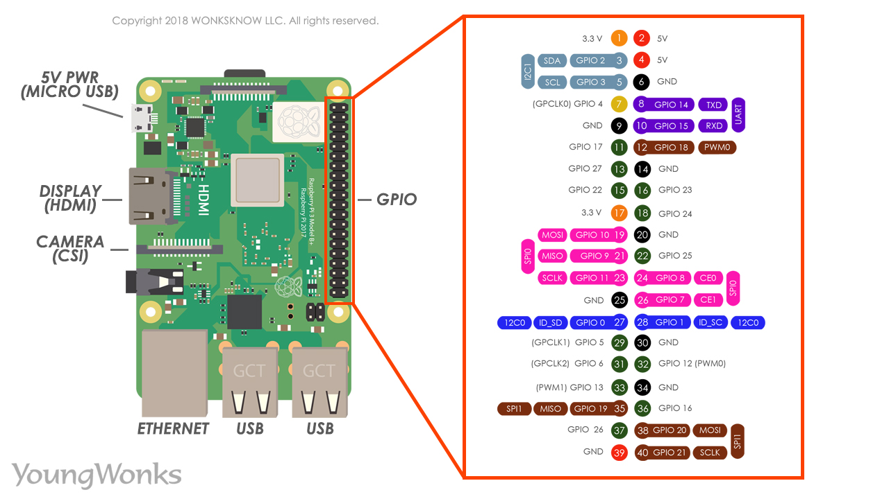

# LED controler

## Devices: Raspberry Pi 3B

## Run program:
Connect LED to GPIO Pin 17


Build module:

```
make
```
Load module to kernel:

```
sudo insmod sample_led_driver.ko
```
Remove module to kernel:

```
sudo insmod sample_led_driver.ko
```

## Usage
Led control:
```
echo 1 | sudo tee /dev/led_device
---------------------------------
echo 0 | sudo tee /dev/led_device
```
Led stage:
```
sudo cat /dev/led_device
```
Check the class and device:
```
ls /sys/class/led_class
-----------------------
ls /dev/led_device
```
## Result:

