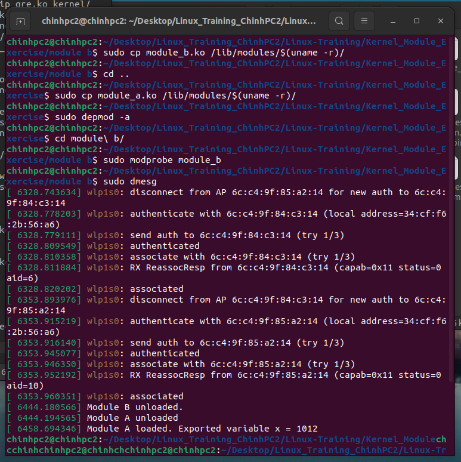

# Kernel Module - Chinh PC2

## 1. Manual Loading
- Load Module A then load Module B:

    ```bash
    sudo insmod module_a.ko
    sudo insmod module_b.ko
    ```
- Verify with Logs:

    ```bash
    sudo dmesg
    ```
- Unload modules if  needed:
    ```bash
    sudo rmmod module_b
    sudo rmmod module_a
    ```

## 2. Automatic Loading via a Tool by `depmod`



## 3. Automatic Loading without a Tool
- Write a script to load Module A then load Module B:

    ```bash
 	#!/bin/bash
 	sudo insmod module_a.ko
 	sudo insmod module_b.ko
    ```
- Runthe script:
    ```bash
    ./load_modules.sh
    ```