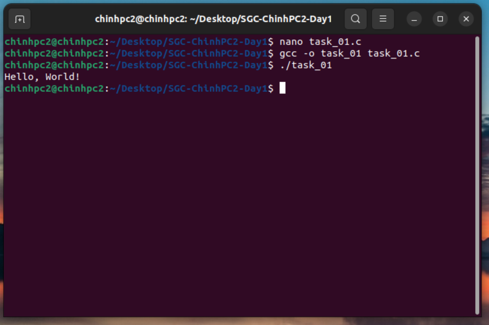
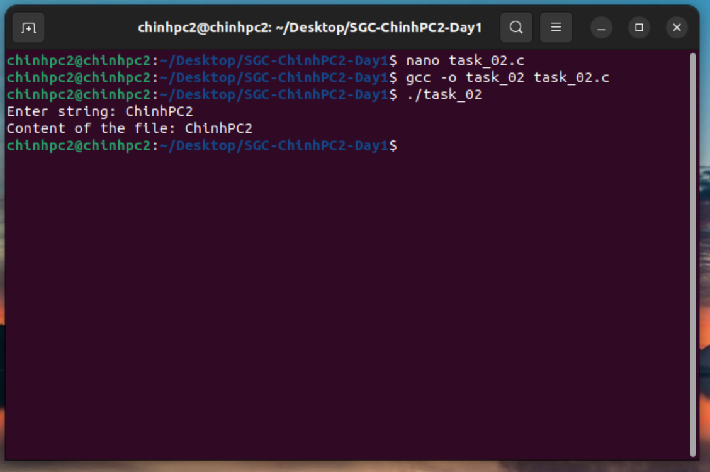
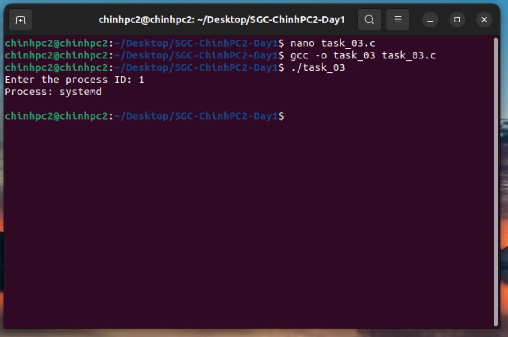
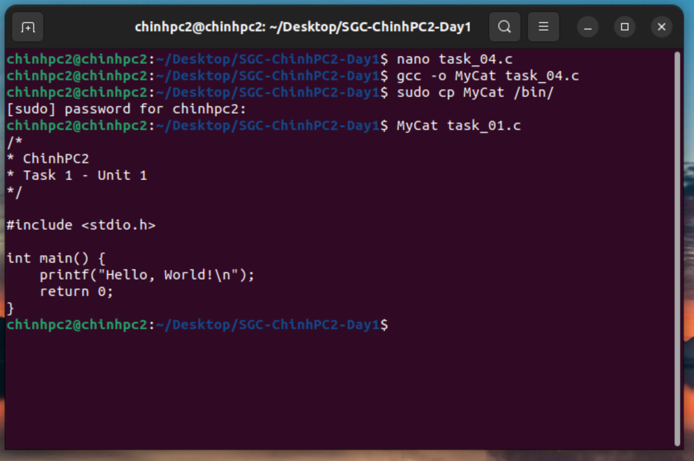
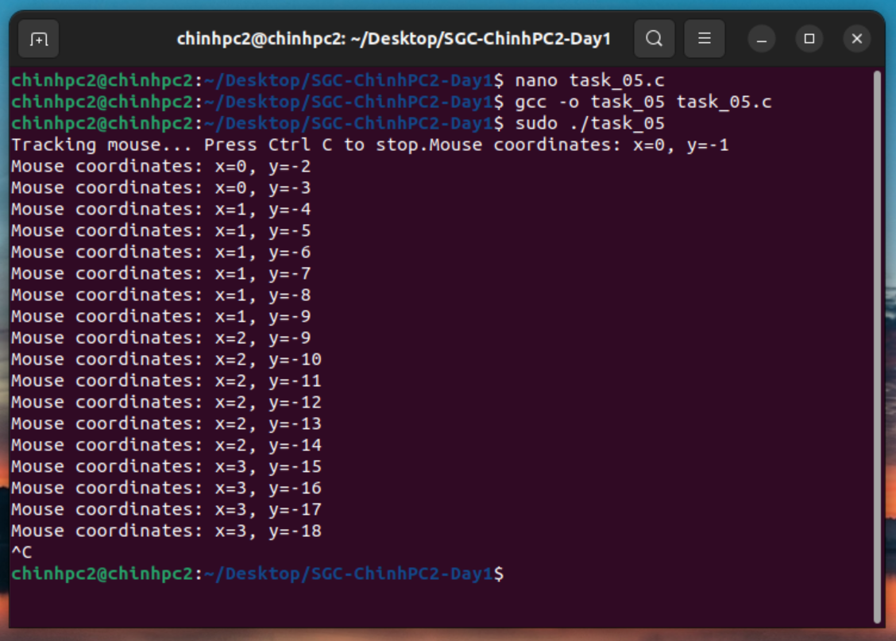

#SGM - ChinhPC2 - Day 1

## Task 1:
Write a simple "Hello World" program in C, compile it using `gcc`, and run the program from the console.

### 1. Terminal operations.
  - Open a terminal and go to main directory.
  - In the `nano` editor, write the C code.
  - Compile your C program using the `gcc` compiler.
  - Run the compiled program.

### 2. Output:
`Hello, World!`

---

## Task 2:
Write a program to print the contents of a text file to the console, with the file path set within the code. 

### 1. Terminal operations.
  - Open a terminal and go to main directory.
  - In the `nano` editor, write the C code.
  - Compile your C program using the `gcc` compiler.
  - Run the compiled program.
  - Enter the input string.

### 2. Output:

---

## Task 3:
Write a program that prints the name of the process from the process ID entered from the keyboard. 

### 1. Terminal operations.
  - Open a terminal and go to main directory.
  - In the `nano` editor, write the C code.
  - Compile your C program using the `gcc` compiler.
  - Run the compiled program.
  - Enter the process ID.

### 2. Output:

---

## Task 4:
Write a program that can display the contents of a file to the console, similar to the cat command. Name it MyCat and copy it to the /bin directory. Then use it like the system's cat command. 

### 1. Terminal operations.
  - Open a terminal and go to main directory.
  - In the `nano` editor, write the C code.
  - Compile your C program using the `gcc` compiler.
  - Coppy the executable file to `/bin/`directory by sudo

### 2. Output:

---

## Task 5:
Write a program that prints the name of the process from the process ID entered from the keyboard. 

### 1. Terminal operations.
  - Open a terminal and go to main directory.
  - In the `nano` editor, write the C code.
  - Compile your C program using the `gcc` compiler.
  - Run the program using sudo 

### 2. Output:

---