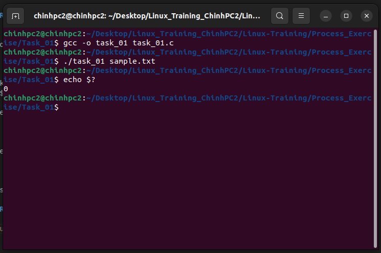

### Task 1: Write a C program that opens any file. If the file opens successfully, return 0 to the parent process; if there is an error, return -1 to the parent process. Use the terminal to run the program and use echo $? to read the return value. 


#### Run program:

```
gcc -o task_01 task_01.c

```
```
./task_01 sample.txt
echo $?
```
If the file myfile.txt exists and can be opened, the output will be:
```
0
```
If the file does not exist or cannot be opened, you will see:
```
255
```
255 is how the shell represents the program's return value of -1.

#### Result:

