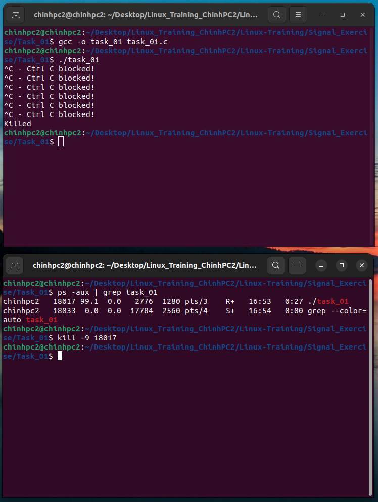

### Task 1: Write a C program to block the Ctrl + C signal (SIGINT) from the user. 


#### Run program:

```
gcc -o task_01 task_01.c

```
```
./task_01
```

#### Kill:

If you wana to kill this process, follow this:


    - Method 1: Suspend by `Ctrl + Z`

    - Method 2: use kill command by: 

        - Step 1: Open new terminal by same folder:
        - Step 2: run `ps -aux | grep task_01`. In here you can see task_01 process is running
        
        - Step 3: By PID off process, use kill command. Eg: `kill -9 16734`


#### Result:

