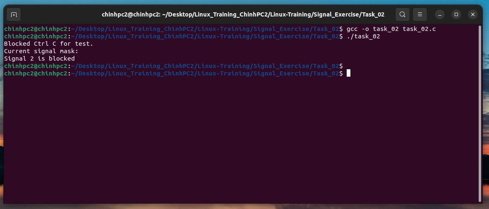

### Task 2:  Write a C program to print the signal mask of the current process. 
Idea: Create Blocked Signal and print to console

#### Run program:

```
gcc -o task_02 task_02.c

```
```
./task_02
```

#### Result:

