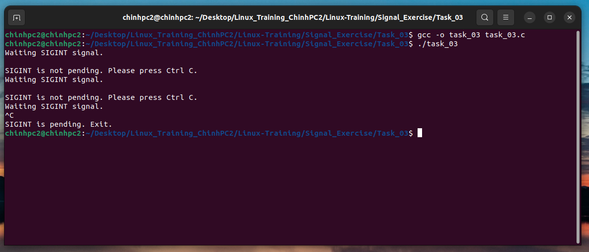

### Task 3: Write a C program to block SIGINT, then check if SIGINT is in the pending signals, and if so, exit the program. 

#### Run program:

```
gcc -o task_03 task_03.c

```
```
./task_03
```
After the program is run, the terminal will display the following message:
```
Waiting SIGINT signal.
```
Now you need to send a signal from the keyboard by pressing `Ctrl + C`. If after 5 seconds you do not press, the program will remind you again.  You must press `Ctrl C` to exit the program
```
Waiting SIGINT signal.

SIGINT is not pending. Please press Ctrl C.
Waiting SIGINT signal
```

#### Result:

