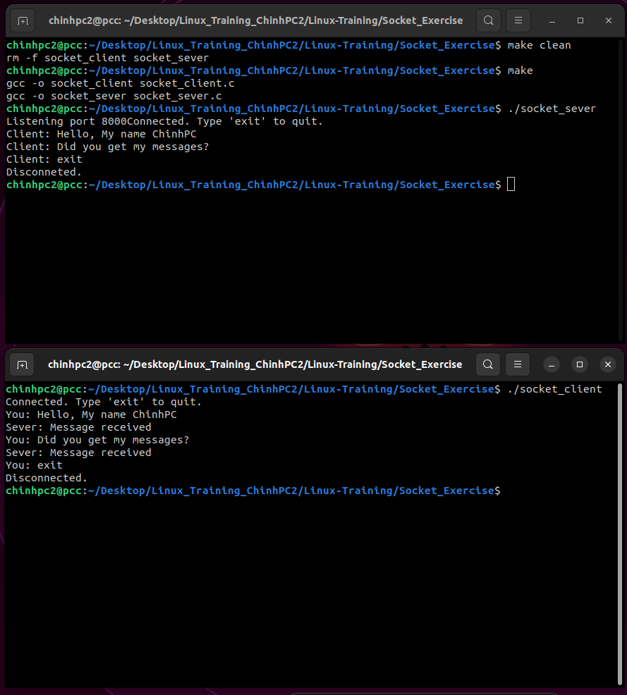

### Task 1: Write a chat program based on the client-server model. Both should run on the same computer. 
#### Run program:

```
make clean
```
```
make
```
Two terminal run two program:

Terminal 1:
```
./socket_sever
```

Terminal 2:
```
./socket_client
```
#### How to use:
- In terminal 1 (client), you can type your message and press "Enter" to send. When terminal 2 (Server) receives message, it will respond "Message received".
- If you want to quit, type "exit". Sever and client will disconnect.

#### Result:


