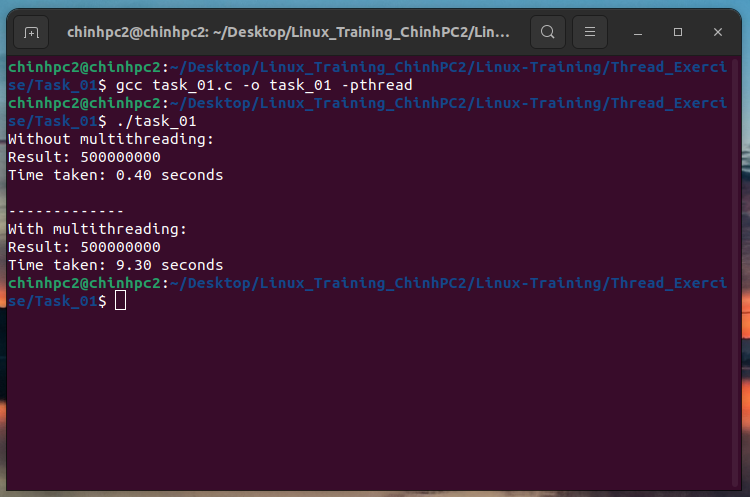

### Task 1: Count the number of odd numbers from 1 to 1 billion. Write code for two cases and compare the execution time of the two cases.

#### - case 1 using multithreading, 
#### - case 2 without using multithreading. 

#### Run program:

```
gcc task_01.c -o task_01 -pthread

```
```
./task_01
```

#### Result:

