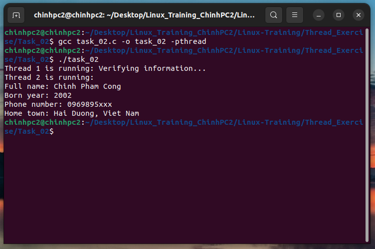

### Task 1: Write a program creating 2 threads . All of them use a handler function. 

#### - If thread 1 is running, printing some verifying information. 
#### - If thread 2 is running, providing a struct called human with some field: full name, born year,  phone number, hometown. 
### Then, print that infor to terminal.

#### Run program:

```
gcc -o task_02 task_02.c -pthread

```
```
./task_02
```

#### Result:

